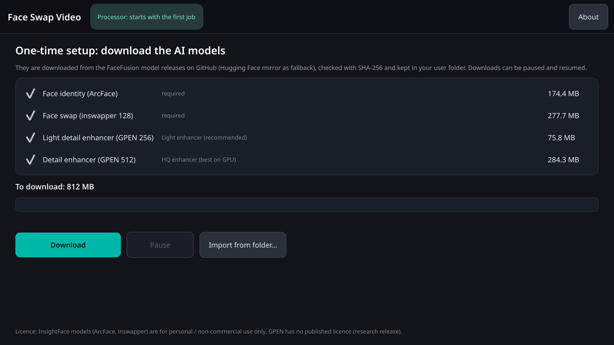
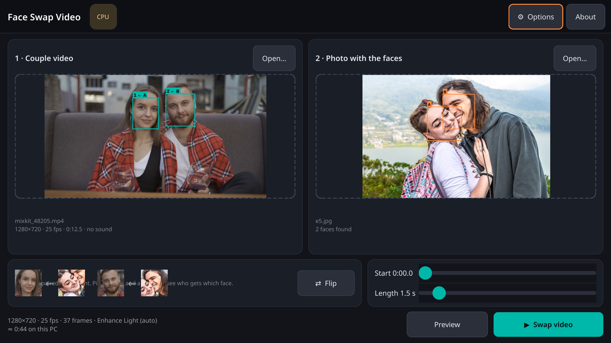
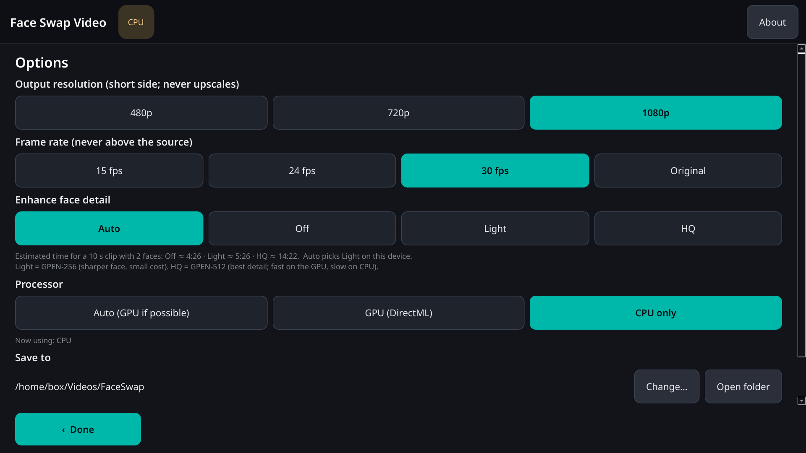
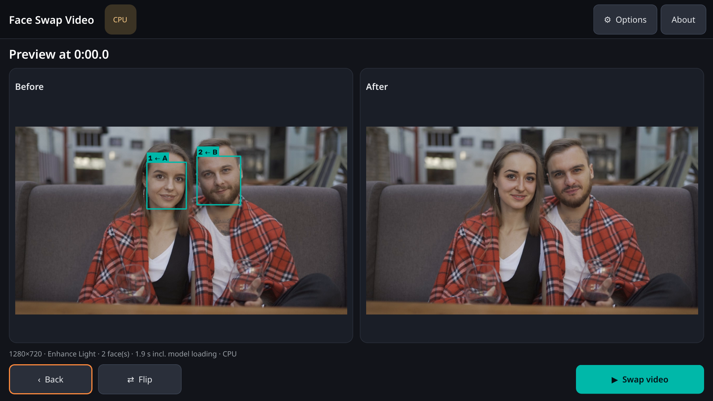
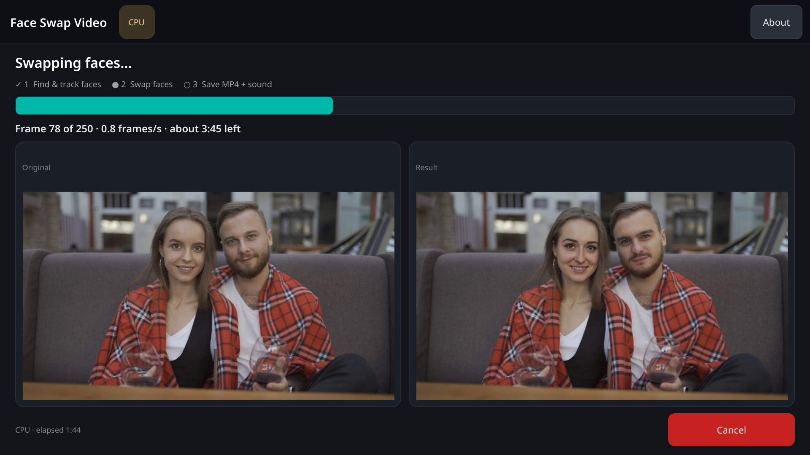
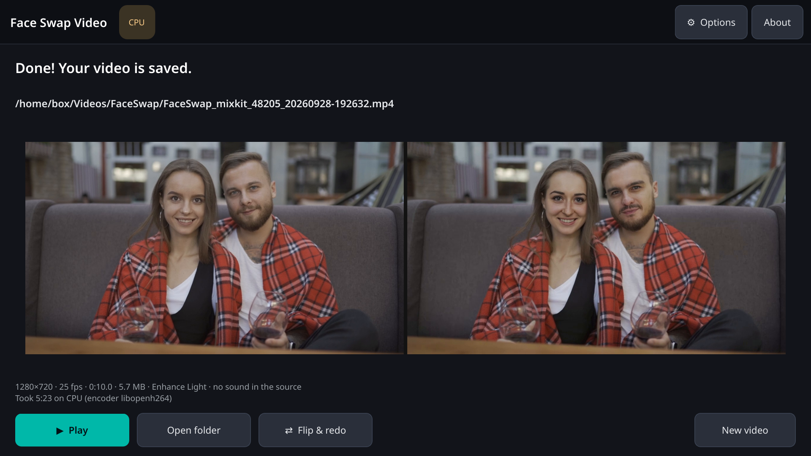

# Face Swap Video for Windows

Native **Windows x64** port of the Android [Face Swap Video](https://github.com/vanukrishnans-source) app, built for the **ASUS ROG Ally X** (Windows 11 handheld: AMD Ryzen Z1 Extreme, Radeon 780M, 24 GB LPDDR5X, 7″ 1920×1080 @ 120 Hz touch + XInput gamepad).

Same pipeline as the phone app: MediaPipe face detection / landmarks → ArcFace identity → inswapper_128 (fp16) → optional GPEN enhancer, with face tracking + One-Euro smoothing so the swap doesn’t flicker, left-to-right pairing with a Flip button, original audio copied through, trim / fps / enhance options, progress with ETA and Cancel.

| | Phone app | This Windows app |
|---|---|---|
| Package | `com.vanu.faceswapvideo` 1.0 | Face Swap Video 1.0 (portable zip) |
| Acceleration | ONNX Runtime CPU (+ optional XNNPACK) | **ONNX Runtime DirectML** on the Radeon 780M, automatic CPU fallback (the UI shows which is in use) |
| Default resolution | ≤ 720p short side | **≤ 1080p** short side (never upscales) |
| Default fps | 15 | **30** (or source if lower) |
| Max clip length | 30 s | **5 minutes** (see [Limits](#limits)) |
| Default enhance | Off (Light / HQ optional downloads) | **Light** (or HQ when the GPU makes it cheap) |
| Output | `Movies/FaceSwap` | `%USERPROFILE%\Videos\FaceSwap` |

**Tech:** Python 3.13 + PySide6 + onnxruntime-directml + MediaPipe + OpenCV, packaged with PyInstaller on GitHub Actions `windows-latest`. Bundled LGPL FFmpeg for H.264 encode + audio mux.

## Download

Grab the latest **`FaceSwapVideo-*-win64.zip`** from the [Releases](https://github.com/vanukrishnans-source/face-swap-video-windows/releases) page. No Python install needed.

### First launch (SmartScreen)

The build is **not code-signed** (no certificate available). Windows SmartScreen will say “Windows protected your PC”:

1. Click **More info**
2. Click **Run anyway**

That’s a one-time prompt per machine. The zip’s SHA-256 is published on the release; you can verify with PowerShell:

```powershell
Get-FileHash .\FaceSwapVideo-1.0.0-win64.zip -Algorithm SHA256
```

### Install / run

1. Unzip anywhere (e.g. `C:\Games\FaceSwapVideo\`).
2. Double-click **`FaceSwapVideo.exe`**.
3. First run downloads **~452 MB** of required models (ArcFace + inswapper). Optional enhancers (both pre-ticked on the setup page, untick to skip): Light ≈ 76 MB, HQ ≈ 284 MB → **812 MB** for everything. Same URLs / SHA-256 as the Android app (FaceFusion GitHub → Hugging Face mirror).

Models stay in `%LOCALAPPDATA%\FaceSwapVideo\models`.

## Features

- Open-file dialogs **and drag-and-drop** for the couple video and the faces photo
- Preview of detected faces in both, left-to-right pairing, **Flip** button
- Before / after preview frame before the full job
- Trim start + length, fps (15 / 24 / 30 / source), resolution cap (480 / 720 / **1080**), enhance Off / Light / HQ / Auto
- Progress with live before/after thumbnails, ETA, Cancel
- Output H.264 MP4 with original audio; **Open file** / **Open folder** buttons
- Touch-friendly dark UI for 7″ 1080p @ 150 % scaling; mouse + keyboard; basic XInput D-pad / A / B / Start navigation
- Shows **GPU · DirectML** or **CPU** (with the reason if DirectML fell back)

## Limits

| Limit | Value | Why |
|---|---|---|
| Max output short side | 1080p | Ally X screen is 1080p; Radeon 780M + 24 GB shared RAM handle it. Never upscales. |
| Max clip length | **300 s (5 min)** | At 1080p / 30 fps / Light enhance, a 5-minute clip is estimated at ~25–70 min on the 780M (HQ: ~1–3 h) and ~1.5–7 h on CPU — about the longest job that is reasonable to leave running on a handheld; output ≈ 350 MB at 1080p30. Temp use stays small because frames are streamed. Longer clips are possible by raising the constant, but the UI would need a stronger “this will take hours” warning. |
| Max fps | 60 (also capped at source fps) | |

## Speed estimates (ASUS ROG Ally X · Radeon 780M · DirectML)

**These are estimates, not measurements on Ally X hardware** (no Ally X / 780M was available to test on). The in-app Options screen runs a micro-benchmark on *your* machine and shows the real ETA.

Grounding measurements (Linux build box, 8 vCPU Xeon, ORT 1.24.4 CPU):

| Stage | Cost |
|---|---|
| inswapper_128 swap incl. warp / blend, CPU | ≈ 0.45–0.85 s / face |
| + GPEN-256 (Light), CPU | ≈ +0.15–0.25 s / face |
| + GPEN-512 (HQ), CPU | ≈ +1.0–1.3 s / face |
| Non-model CPU work (warp / mask / blend) @ 720p | Off 19 ms · Light 57 ms · HQ 145 ms per face (single thread, parallelised over 4 workers in the app) |
| Same @ 1080p | Off 38 ms · Light 100 ms · HQ 190 ms per face |
| MediaPipe detection (pass 1) | ≈ 20 ms / frame @ 720p, multi-threaded |

Why the 780M is expected to be ~8–15× faster than that CPU for the models:

- Radeon 780M (RDNA3, 12 CU, ≤ 2.7 GHz): ≈ 8.3 TFLOPS FP32 / 16.6 TFLOPS FP16 — roughly GTX 1650-class throughput, sharing LPDDR5X-7500 bandwidth with the CPU.
- DirectML typically reaches ~50–70 % of the CUDA EP on equivalent NVIDIA hardware for mid-size CNNs; a UM790 (same 780M) user measured Stable Diffusion ≈ 3× faster on the 780M than on its Zen 4 CPU.
- Resulting model-time estimate per face on 780M DirectML: **swap 40–90 ms, +Light 25–60 ms, +HQ 120–250 ms**. Model calls are serialised on one GPU queue; CPU work overlaps on other cores, so the GPU is the bottleneck. Output resolution barely changes model time (faces are always 128/256/512 px), so 1080p is only ~10–20 % slower than 720p (warp/blend, decode, encode). `h264_amf` hardware encode is negligible. Upper bounds include ~1.5× for the handheld's shared power budget / thermals.

| 10 s clip, 30 fps, 2 faces (300 frames, 600 face swaps) | Off | Light | HQ |
|---|---|---|---|
| 720p · DirectML (est.) | **0.5–1.5 min** | **0.8–2 min** | **2–5 min** |
| 1080p · DirectML (est.) | **0.6–1.7 min** | **0.9–2.3 min** | **2.2–5.5 min** |
| 720p · CPU only (Zen 4, est.) | 2–3 min | 2.5–4.5 min | 7.5–13 min |
| 1080p · CPU only (Zen 4, est.) | 2.2–3.5 min | 3–5 min | 8–14 min |

Add ~5–15 s once per job for DirectML session creation / warm-up. **Auto** enhance picks HQ when the measured `swap + GPEN-512` time is ≤ 0.35 s per face (expected on the 780M), otherwise Light (CPU), otherwise Off.

Encoder preference on Ally X: **`h264_amf`** (AMD VCN) → `h264_mf` → `libopenh264`.

## Licence / models

- **App code:** MIT (see `LICENSE`).
- **InsightFace models** (ArcFace, inswapper): **personal / non-commercial research only**. Commercial use needs a licence from [insightface.ai](https://insightface.ai).
- **GPEN-BFR:** research release (Alibaba DAMO); treat as personal / non-commercial.
- **FFmpeg:** LGPL build (see `THIRD_PARTY.md` and the `ffmpeg/` folder in the zip).
- Don’t use this app to impersonate or deceive anyone; only swap faces of people who agreed to it.

## Screenshots

Rendered by the real app (offscreen Qt, 150 % scale, 1920×1080) with real models, real detection, a real partial download and a real short job — on the Linux build box, so the device chip shows **CPU** and the encoder is libopenh264. CI screenshots from the Windows runner are in `screens/ci/`.

| Setup | Main (faces + pairing) |
|---|---|
|  |  |

| Options | Preview (before / after) |
|---|---|
|  |  |

| Progress | Done |
|---|---|
|  |  |

Side-by-side sample (original | swapped): [`samples/side_by_side_48205.mp4`](samples/side_by_side_48205.mp4).

## Build from source

Needs a Windows x64 machine (or the GitHub Actions workflow below).

```powershell
# Python 3.13
py -3.13 -m venv .venv
.\.venv\Scripts\Activate.ps1
pip install -r requirements-win.txt
pip install --no-deps mediapipe==1.0.1

# LGPL FFmpeg next to the app
powershell -File packaging\download_ffmpeg.ps1

# Dev run
$env:FSV_MODELS = "$env:LOCALAPPDATA\FaceSwapVideo\models"
python -m fsv

# Package
pyinstaller FaceSwapVideo.spec
powershell -File packaging\make_zip.ps1
# -> dist\FaceSwapVideo-<ver>-win64.zip + dist\SHA256SUMS
```

### GitHub Actions

Push a tag `v*` (or run the workflow manually) to build on `windows-latest`, run `--selftest` on the packaged exe (CPU + DirectML smoke), and publish the zip as a release asset. See [`.github/workflows/build.yml`](.github/workflows/build.yml).

### Headless / selftest

```text
FaceSwapVideo_cli.exe --selftest --video testdata\sample_2s.mp4 --photo testdata\faces_e5.jpg --device cpu --enhance off --dml-smoke
FaceSwapVideo_cli.exe --run VIDEO PHOTO OUT --enhance gpen256 --device auto
FaceSwapVideo_cli.exe --bench --device dml
```

## Parity with the Android / Python reference

Same inputs as the Android Face Swap Video parity suite (`mixkit_48205` + Light, `mixkit_49656` Off). Tracking / pairing / smoothed landmarks are **bit-identical** to the reference; per-frame swap PSNR vs the reference is **88–93 dB** (max |Δ| = 1 level) — same band as the Android Kotlin port.

| Clip | Tracks / pairing | Landmark max \|Δ\| | Frame PSNR |
|---|---|---|---|
| 48205 0–8 s · 15 fps · 720p · Light | identical `[0,1]@0` | 0 px | 88.9–89.9 dB |
| 49656 full · 15 fps · 720p · Off | identical `[1,0]@61` | 0 px | 90.3–92.8 dB |

Reports: `reports/parity_*.txt` (Linux) and `reports/ci/parity/parity_windows.txt` (packaged exe vs reference on windows-latest, PSNR 86.7–88.1 dB, tracking/pairing identical).

## What runs where

| | This Linux build box | GitHub Actions `windows-latest` | Ally X (target) |
|---|---|---|---|
| Pipeline / parity / selftest (CPU) | ✅ verified | ✅ in CI | ✅ |
| DirectML EP | ❌ (no DML on Linux) | EP is in the build; session falls back to CPU on Hyper-V (no GPU / WARP not used) — UI shows “CPU (GPU unavailable: …)” | ✅ Radeon 780M |
| `h264_amf` hardware encode | ❌ | ❌ | ✅ |
| Touch UI / XInput | screenshots offscreen | screenshots offscreen | ✅ |
| Packaged `.exe` | built in CI | ✅ selftest + parity + zip release | ✅ |

## Privacy

Everything runs on-device. No analytics, no network calls except the first-run model download (and optional enhancer downloads).
